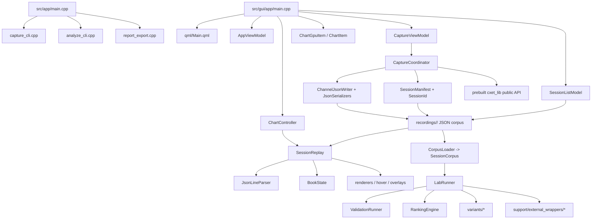

# Runtime Graph

Owns:

- Top-level runtime flow.
- Where each entrypoint hands off next.

Depends on:

- `src/app/`
- `src/gui/`
- `src/core/`
- prebuilt `cxet_lib`

Used by:

- Any agent trying to answer "where do I start?"

Fast path:

- Capture problem: go to [[03_CAPTURE]]
- Replay or viewer problem: go to [[04_REPLAY_VALIDATION]] and [[05_GUI_VIEWER]]
- Compression or benchmarking problem: go to [[06_LAB_VARIANTS]]

